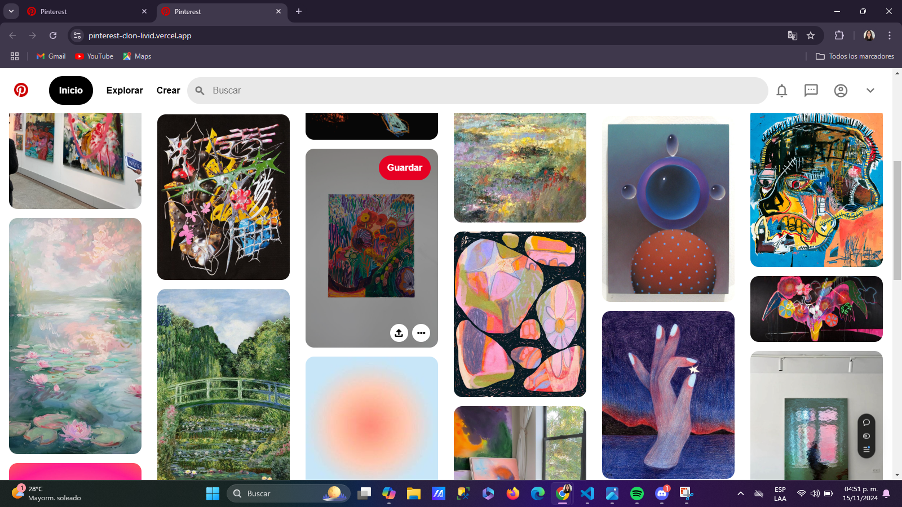

# Clon de la Página principal de Pinterest 

 

## Descripción 

Este proyecto es un clon del frontend de la página principal de Pinterest, desarrollado como parte de una práctica para el curso de Frontend con Tecnolochicas Pro. El objetivo es recrear la apariencia y diseño de la página principal de Pinterest. 

## Contenido del Proyecto 

- **index.html**: El archivo HTML principal que contiene la estructura de la página. 
- **styles.css**: El archivo CSS que contiene los estilos y el diseño de la página. 
- **assets**: Carpeta que contiene las imágenes utilizadas en la página. 
- **README.md**: Este archivo README que proporciona información sobre el proyecto. 

## Estructura del Proyecto

El proyecto contiene los siguientes archivos y carpetas:

pinterest-clone/
├── index.html
├── style.css
├── README.md
└── assets/
    ├── 1.jpg
    └── 2.jpg

## Instalación y uso:

1. **Clonar el repositorio:**
```sh
git clone https://github.com/Valeriagalaviz/pinterest-clon.git
```
2. **Abrir el proyecto:** 
Accede a la carpeta del proyecto
```sh
cd pinterest-clone
```
3. **Abre el archivo index.html en tu navegador:**
En Windows: Haz doble clic en el archivo index.html.

4. **Visualización en línea:** 
Para ver el proyecto en línea, visita:[https://pinterest-clon-livid.vercel.app/](https://pinterest-clon-livid.vercel.app/)

## Créditos

Este proyecto es para fines educativos, pero se inspira en la página principal de Pinterest.

## Contacto
Para cualquier pregunta o comentario, puedes contactarme a través de los siguientes medios: 
- **GitHub**: [Valeriagalaviz](https://github.com/Valeriagalaviz) 
- **Correo Electrónico**: [valeriagalavizrodriguez@gmail](valeriagalavizrodriguez@gmail.com)